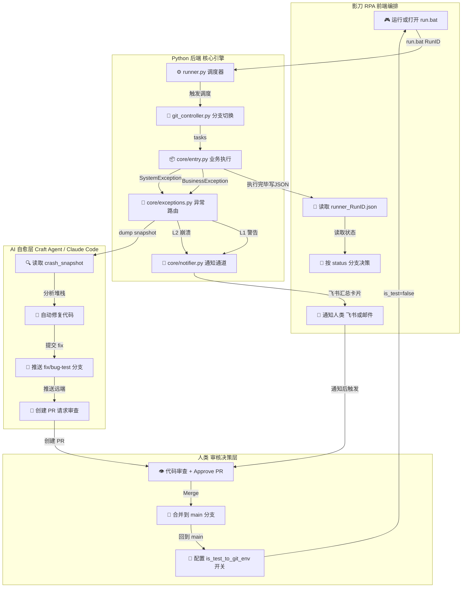
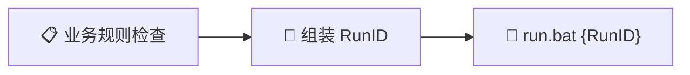
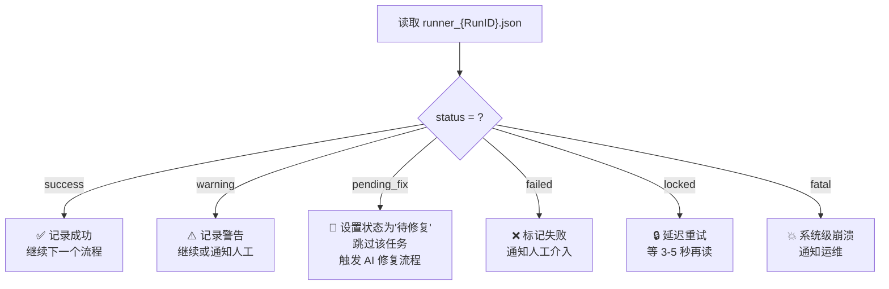
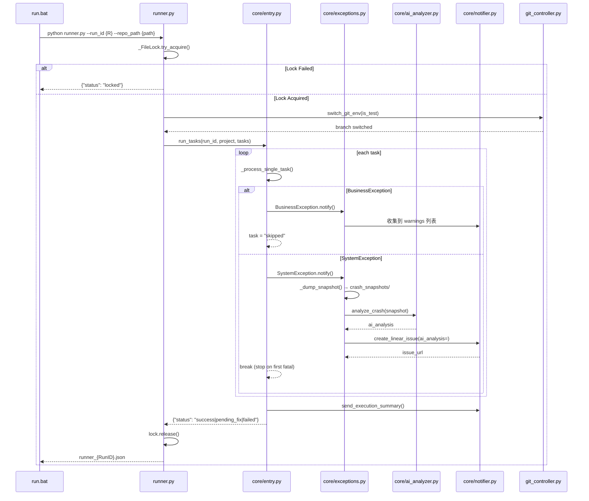
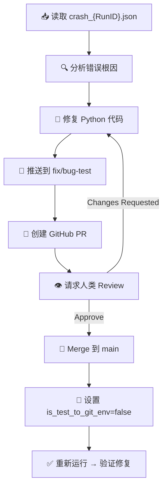

# 人机协助流程 — 影刀 RPA + Python 后端 + AI 自愈

> **核心思想**: 各司其职，松耦合。影刀处理"人机交互 + UI 操作"，Python 处理"业务逻辑 + 异常路由"，AI 负责"自动修复 + 知识沉淀"。
> 版本: 1.0 | 2026-05-09

---

## 一、架构总览

### 角色矩阵

---

## 二、影刀 RPA — 职责清单

### 2.1 启动执行



影刀通过 **「运行或打开」** 指令调用 `run.bat`，传入一个唯一 RunID（推荐用 `{CurrentRunID}` 变量）。

**RunID 规范**：建议使用影刀的 `{CurrentRunID}` 或自定义格式 `{项目缩写}_{流水号}`，用于追踪每次执行。

### 2.2 读取结果

执行完毕后，影刀读取 `D:\CraftPJ\{项目名}\runner_{RunID}.json` 文件：

```datatable
{
  "title": "runner_{RunID}.json 标准输出格式",
  "columns": [
    { "key": "field", "label": "字段", "type": "text" },
    { "key": "type", "label": "类型", "type": "badge" },
    { "key": "meaning", "label": "含义", "type": "text" }
  ],
  "rows": [
    { "field": "status", "type": "string", "meaning": "执行结果状态码（详见下方状态表）" },
    { "field": "message", "type": "string", "meaning": "人类可读的执行摘要" },
    { "field": "data.run_id", "type": "string", "meaning": "回显的 RunID，用于关联" },
    { "field": "data.results", "type": "array", "meaning": "每个任务的执行结果列表" },
    { "field": "data.errors", "type": "array", "meaning": "系统异常列表（含 error_type / issue_url）" },
    { "field": "data.warnings", "type": "array", "meaning": "业务异常列表（含 context）" },
    { "field": "data.crash_snapshot_dir", "type": "string", "meaning": "快照目录（仅 SystemException 时出现）" }
  ]
}
```

### 2.3 状态决策树

影刀**必须**按 `status` 字段分支决策：



### 2.4 状态码详解

| status | 含义 | 影刀动作 | 是否重试 |
|--------|------|----------|----------|
| `success` | 全部任务成功完成 | 继续下一个流程 | ❌ 不重试 |
| `warning` | 部分任务因业务规则跳过 | 可选通知，继续 | ❌ 不重试 |
| `pending_fix` | 系统异常，已创建 Linear 工单 + crash snapshot | 标记为"修复中"，等待 AI 修复 | ⏳ AI 修复完成后重试 |
| `failed` | 系统异常，但未创建工单（如测试环境） | 标记失败，通知人类 | ❌ 需人工处理 |
| `locked` | 另一个实例正在运行同一项目 | 等待 3-5 秒后重试 | ✅ 可重试 |
| `fatal` | runner.py 本身崩溃，未进入业务逻辑 | 标记系统错误，通知运维 | ❌ 需修复 |

### 2.5 不需要负责的

| 影刀不需要做的事 | 原因 |
|------------------|------|
| 解析 Python 堆栈 | Python 后端已解析好，放入 crash snapshot |
| 直接调用 Linear API | Python 后端统一管理通知通道 |
| 管理 Git 分支 | Python 后端 + AI 层处理分支切换 |
| 复杂 JSON 深度解析 | 影刀只读顶层 `status` 做分支 |
| 重试逻辑 | `locked` 状态只需简单延迟重试 |

---

## 三、Python 后端 — 职责清单

### 3.1 文件职责

| 文件 | 职责 | 输入 | 输出 |
|------|------|------|------|
| `run.bat` | 系统入口，设置环境变量 | RunID | 调用 runner.py |
| `runner.py` | 调度器：配置加载、文件锁、Git 切换、业务入口 | RunID + repo_path | `runner_{RunID}.json` |
| `core/entry.py` | 业务执行引擎：任务循环 + 异常捕获 | tasks 列表 | 执行结果汇总 |
| `core/exceptions.py` | 异常路由：L1/L2+快照+AI分析 | 异常实例 | 通知/快照/AI分析 |
| `core/notifier.py` | 通知通道：飞书（L1）+ Linear（L2） | 错误信息 | 飞书卡片/Linear 工单 |
| `core/config.py` | 全局配置（含 AI 分析） | project.json | 配置对象 |
| `git_controller.py` | Git 分支切换 | is_test 标记 | 分支切换结果 |
| `core/__init__.py` | 模块导出 | — | 统一导入接口 |
| `core/ai_analyzer.py` | AI 崩溃分析（Volcengine Ark） | crash snapshot | AI 根因/修复/分类 |

### 3.2 执行流程



### 3.3 异常路由详解

```
                            Exception
                               │
                    ┌──────────┴──────────┐
                    │                     │
          BusinessException         SystemException
               (L1)                     (L2)
                    │                     │
            ┌───────┴───────┐     ┌───────┴──────────────┐
            │               │     │                      │
      收集到 warnings  任务继续   _dump_snapshot()     analyze_crash()
            │               │     │                      │
       飞书汇总卡片           │   crash_xxx.json    AI 根因/修复/分类
            │               │     │                      │
       send_execution_      │     └────→ create_linear_issue(ai_analysis=)
       summary() — ALL      │                    │
       异常一起发            │             Linear 工单（AI 增强）
```

### 3.4 配置合并策略

```
project.template.json (版本控制追踪)
         │
         ▼ 合并 (template 先，user 后覆盖)
project.json (gitignored, 含 API Key)
         │
         ▼
运行时使用的完整配置
        
is_test_to_git_env 控制:
  false → 保持在 main 分支（生产）
  true  → 切换到 fix/bug-test 分支（修复验证）
```

---

## 四、AI 自愈层 — 职责清单

### 4.1 触发条件

当系统产生 `pending_fix` 状态时，AI 被触发：

1. **E 主动触发**: 影刀通知人类 → 人类启动 AI 会话 → AI 读取 snapshot
2. **自动触发**: 从飞书/Linear 获取事件 → Craft Agent 自动展开修复流程

### 4.2 AI 修复流程



### 4.3 Crash Snapshot 格式（AI 读取）

```json
{
  "snapshot_type": "crash",
  "timestamp": "2026-05-09 19:12:00",
  "run_id": "RPA_001",
  "error_type": "ValueError",
  "message": "task_id=0 invalid",
  "action": "Execute [测试任务]",
  "expected": "positive task_id",
  "actual": "got task_id=0, abort",
  "traceback": "Traceback (most recent call last):\n...",
  "file": "core/entry.py",
  "function": "_process_single_task",
  "line": "14",
  "code": "",
  "payload": {"id": 0, "name": "测试任务"},
  "project": "dev-template"
}
```

---

## 五、完整协作示例

### 场景：RPA 物流发货，数据解析出错

| 步骤 | 谁做 | 动作 |
|------|------|------|
| 1 | **影刀** | 从物流网页抓取数据，调用 `run.bat ORD_20260509` |
| 2 | **Python** | `runner.py` 解析数据，`entry.py` 校验发现数据格式非法 |
| 3 | **Python** | `BusinessException` → 收集到 warnings，继续处理下一条 |
| 4 | **Python** | 处理 10 条后，第 11 条触发 `SystemException`（数据库连接失败） |
| 5 | **Python** | `exceptions.py` dump snapshot → `crash_ORD_20260509.json` |
| 6 | **Python** | `notifier.py` 创建 Linear 工单 + 飞书汇总卡片（含 1 条 warning + 1 条 error） |
| 7 | **Python** | 返回 `{"status": "pending_fix", ...}` 到 runner_ORD_20260509.json |
| 8 | **影刀** | 读取 JSON，status="pending_fix" → 标记任务为"修复中" |
| 9 | **飞书** | 发送红色告警卡片到 RPA 运维群 |
| 10 | **AI** | Craft Agent 读取 crash snapshot，分析堆栈 |
| 11 | **AI** | 定位到数据库连接代码，自动修复并推送到 `fix/bug-test` |
| 12 | **AI** | 创建 GitHub PR，`@reviewer` 请求审查 |
| 13 | **人类** | Review 代码，Approve PR，Merge 到 main |
| 14 | **人类** | 通知影刀重试 ORD_20260509 |
| 15 | **影刀** | 重新运行 → success |

---

## 六、项目配置说明

### project.template.json（版本控制）

```json
{
  "project": "项目名称",
  "is_test_to_git_env": false,
  "version": "1.0.0"
}
```

### project.json（本地 + .gitignore）

```json
{
  "project": "项目名称",
  "is_test_to_git_env": false,
  "feishu_webhook": "https://open.feishu.cn/...",
  "linear": {
    "api_key": "lin_api_xxx",
    "team_id": "team_xxx",
    "project_name": "项目名",
    "project_id": ""
  },
  "ai": {
    "enabled": true,
    "api_key": "",
    "model": "glm-4-7-251222",
    "timeout": 30
  }
}
```

---

## 七、目录结构约定

```
D:\CraftPJ\{项目名}\
├── run.bat                  ← 影刀入口（UTF-8，无BOM）
├── runner.py                ← Python 调度器
├── project.json             ← 本地配置（.gitignore）
├── project.template.json    ← 模板配置（版本控制）
├── .gitignore
├── core/
│   ├── __init__.py
│   ├── entry.py             ← 业务入口
│   ├── exceptions.py        ← 异常路由
│   ├── notifier.py          ← 通知
│   └── config.py            ← 配置
├── git_controller.py        ← 分支管理
├── crash_snapshots/         ← 崩溃快照（AI 自愈输入）
├── data/                    ← 数据文件
└── tests/                   ← Pytest 测试
```

---

## 八、新手快速定位

| 你想做什么 | 看哪个文件 | 怎么改 |
|-----------|-----------|--------|
| 写业务逻辑 | `core/entry.py` 的 `run_tasks()` | 替换 `_process_single_task` 中的示例代码 |
| 加新的通知通道 | `core/notifier.py` | 新增函数，在 `send_execution_summary()` 中调用 |
| 改异常分类 | `core/exceptions.py` | 新增 Exception 子类，定义 notify 行为 |
| 调整分支策略 | `git_controller.py` | 修改 `switch_git_env()` 逻辑 |
| 配置 API Key | `project.json` | 编辑 JSON 文件 |
| 写测试 | `tests/` | 新增 `test_*.py` 文件 |
