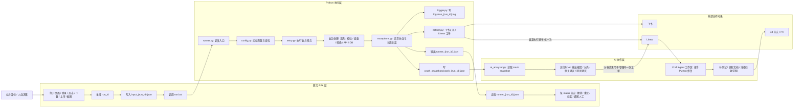
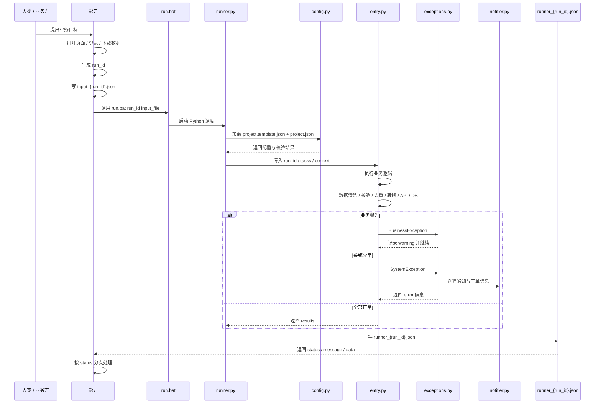
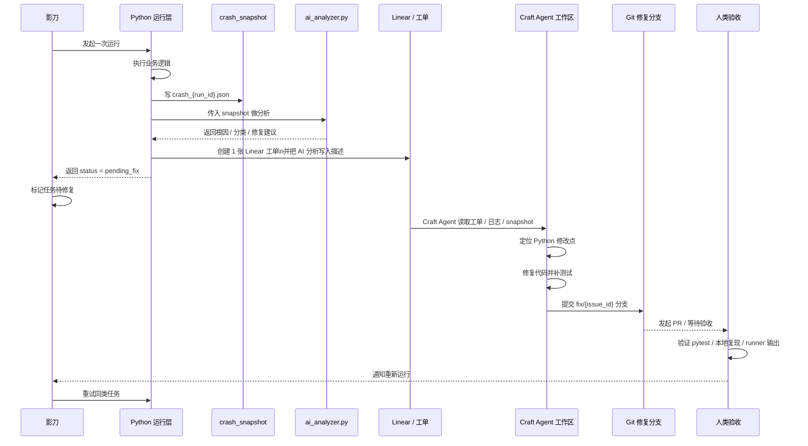

# 项目架构总览

> 目标：让人一眼看懂这个项目里，影刀做什么，Python 做什么，AI 做什么，`Craft Agent` 在哪里参与。  
> 适用对象：RPA 开发、Python 开发、AI 协作开发、验收人。

## 1. 一句话理解

这个项目可以理解成四层协作：

1. 影刀负责“拿数据、点页面、调入口、读结果、做分支”。
2. Python 负责“真正执行业务逻辑、处理数据、写日志、输出标准结果”。
3. AI 分两类：
   - 运行时 AI：分析崩溃快照，给出根因和修复建议。
   - `Craft Agent`：在另一个 AI 工作区里接手 Python 修复、补测试、更新文档。
4. 人类负责需求拆分、最终验收、合并发布。

## 2. 角色分工图



## 3. 一眼看懂各层职责

| 角色 | 它负责什么 | 它不负责什么 |
|------|------------|--------------|
| 影刀 | 页面操作、文件下载上传、调用 `run.bat`、读取 `runner`、按状态分支 | 不解析 Python 堆栈，不写业务规则，不修 Python |
| Python | 读取输入、执行业务逻辑、异常分类、日志、通知、输出标准结果 | 不做人机交互，不接管影刀页面流程 |
| 运行时 AI | 读取 `crash snapshot`，给根因、分类、修复建议 | 不直接改线上影刀流程 |
| `Craft Agent` | 在独立 AI 工作区里修改 Python、补测试、更新文档、准备修复分支 | 不代替影刀执行 UI 操作 |
| 人类 | 提需求、确认边界、验收、合并发布 | 不需要手工解析所有技术细节 |

## 4. 主执行流程图

这张图描述“任务正常进入系统并执行”的主链路。



## 5. 异常修复闭环图

这张图描述“Python 出错后，AI 怎么接手修复”，也是 `Craft Agent` 发挥价值的地方。



## 6. 工单创建逻辑说明

这里最容易误解的点是：图里既有 `crash snapshot -> AI`，又有 `Python / notifier -> Linear`，看上去像创建了两次工单。

实际不是。

一次 `SystemException` 的真实顺序是：

1. `exceptions.py` 先写 `crash_{run_id}.json`
2. `ai_analyzer.py` 读取快照，生成根因、分类、修复建议、测试建议
3. `notifier.py::create_linear_issue()` 调用 Linear `issueCreate`
4. 创建的仍然是同一张工单，只是工单标题和描述里带上了 AI 分析结果
5. 飞书汇总通知里如果有 `issue_url`，只是附上这张工单的链接，不会再创建新工单

可以把它理解成：

```text
先分析 -> 再建单 -> AI 结果写进这 1 张工单 -> 飞书引用这 1 张工单
```

补充规则：

- `BusinessException` 不创建 Linear 工单
- `SystemException` 才尝试创建 Linear 工单
- 非生产分支下可能跳过真实建单，只保留结果和日志

## 7. 关键文件在链路中的位置

| 文件 | 它在流程里的位置 | 作用 |
|------|------------------|------|
| `run.bat` | 影刀调用入口 | 连接影刀和 Python |
| `runner.py` | Python 总调度器 | 读取输入、调配置、执行业务、输出结果 |
| `core/config.py` | 执行前 | 配置加载与自检 |
| `core/entry.py` | 主业务层 | 执行任务和汇总结果 |
| `core/exceptions.py` | 异常路径 | 统一异常编码、状态、snapshot |
| `core/logger.py` | 执行中 | 写运行日志 |
| `core/notifier.py` | 异常后 | 飞书汇总与工单创建 |
| `core/ai_analyzer.py` | 系统异常后 | 分析 crash snapshot |
| `docs/examples/*` | 需求、测试、协作时 | 输入输出协议样例 |

## 8. 推荐展示话术

如果你要对别人解释这个项目，可以直接用这段：

```text
影刀只负责和页面打交道，并把任务标准化后交给 run.bat。
Python 是真正的业务执行引擎，负责数据处理、规则判断、日志、异常和标准输出。
运行出错后，系统会产生日志、runner 结果和 crash snapshot。
AI 先分析 crash snapshot，再由 Craft Agent 在另一个 AI 工作区里接手 Python 修复、补测试、提分支，最后由人类验收合并。
```

## 9. 与现有文档的关系

- 职责边界：见 [RPA_PYTHON_BOUNDARY.md](D:\CraftPJ\开发模板\docs\RPA_PYTHON_BOUNDARY.md)
- 需求模板：见 [REQUIREMENT_TEMPLATE.md](D:\CraftPJ\开发模板\docs\REQUIREMENT_TEMPLATE.md)
- 修复闭环：见 [ISSUE_FIX_WORKFLOW.md](D:\CraftPJ\开发模板\docs\ISSUE_FIX_WORKFLOW.md)
- 验收清单：见 [ACCEPTANCE_CHECKLIST.md](D:\CraftPJ\开发模板\docs\ACCEPTANCE_CHECKLIST.md)
- 接口样例：见 [INTERFACE_EXAMPLES.md](D:\CraftPJ\开发模板\docs\INTERFACE_EXAMPLES.md)
